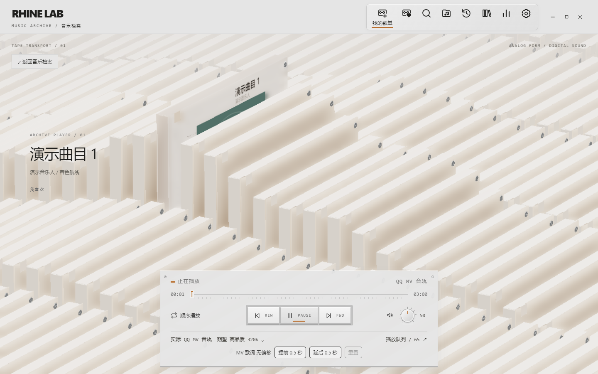
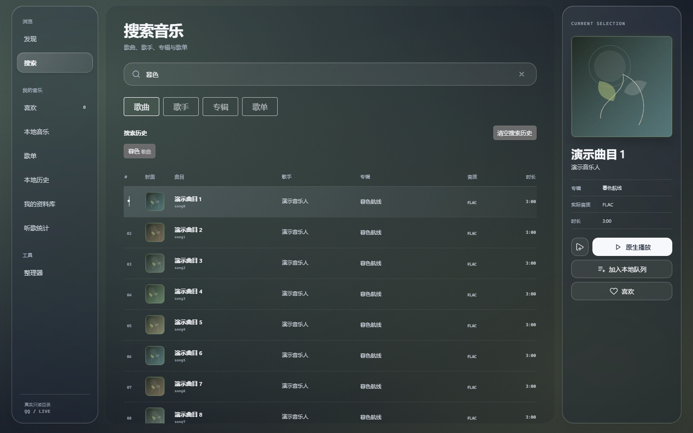
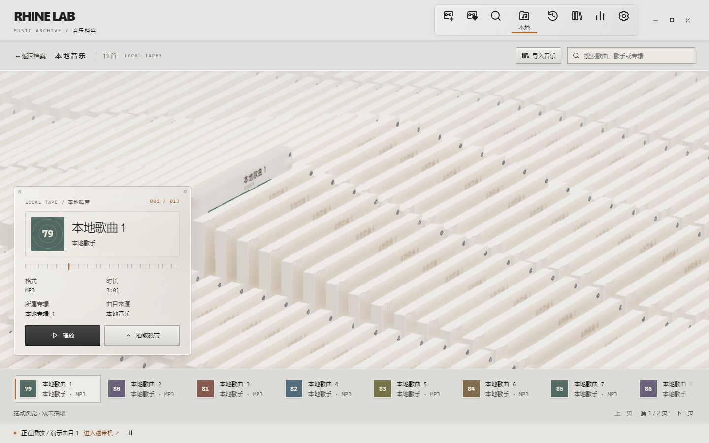
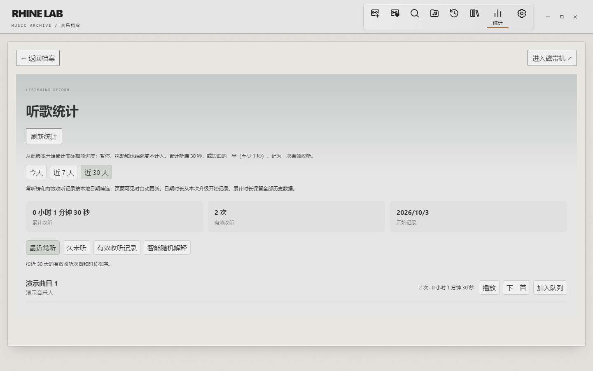
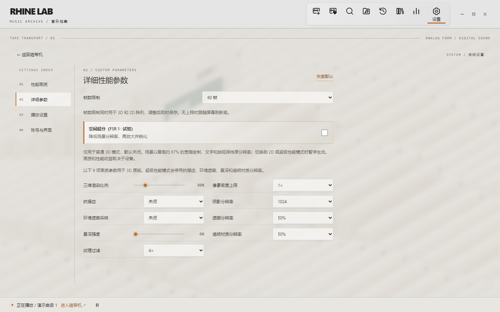

<div align="center">

# QQ Music GUI

**为 Windows 打造的本地 QQ 音乐客户端，提供日常界面与莱茵磁带档案界面。**

[](https://github.com/zhazhongshizi/qqmusic-gui/releases/latest)
[](#下载安装)
[](LICENSE)

[下载安装](https://github.com/zhazhongshizi/qqmusic-gui/releases/latest) · [使用说明](#开始使用) · [源码构建](#从源码运行) · [反馈问题](https://github.com/zhazhongshizi/qqmusic-gui/issues)

</div>


> 当前版本：**1.1.0**。截图使用实际应用前端与隔离的虚构演示数据生成；曲目、账号、封面及统计均不来自真实用户。它们展示界面，不代表真实账号权益或播放验收。

## 功能

| 功能 | 说明 |
| --- | --- |
| 两套界面 | 日常音乐界面与莱茵磁带档案界面，共用账号、队列和播放器 |
| 登录与目录 | QQ／微信二维码登录；歌曲、歌手、专辑、歌单搜索与详情 |
| 歌单管理 | 创建／收藏的歌单、喜欢歌曲、添加／移除歌曲、多选批量入队 |
| 原生播放 | Windows 原生媒体播放器、歌词、进度、音量、上一首／下一首 |
| 音质 | 无损优先、高品质 320k、标准 128k，受账号权益与服务端限制 |
| MV 音轨补播 | 原曲不可用时尝试关联 MV 的授权音轨，支持歌词偏移；仍传输视频流 |
| 本地音乐 | 多目录索引、引用／复制导入、后台扫描与路径修复，搜索、播放与加入队列 |
| 个人资料库 | 保存队列、收藏专辑／歌手、最近播放、时间范围图表与收听习惯分析 |
| 回忆磁带 | 莱茵月度音乐档案、磁带柜与立体翻面，可回放仍可播放的历史歌曲 |
| 智能随机 | 根据近期播放与喜欢列表，让久未听的曲目有机会出现 |
| Windows 集成 | 系统媒体键、SMTC、托盘、迷你播放视图与可选动态歌词 |
| 局域网控制 | 设置中开启 Remote WebUI，通过连接码控制播放与浏览目录 |
| 渲染设置 | 莱茵 3D／2D、30／60 帧限制、超级性能模式与 FSR 1 试验 |
| 版本与更新 | 手动检查官方稳定版本、可选启动后台检查、更新日志与数据迁移保护 |

本项目不提供音频下载、离线音频缓存、DRM 解密或账号权益绕过。它不是腾讯或 QQ 音乐的官方客户端。

## 界面预览

### 莱茵磁带机

磁带随播放状态变化，曲目信息、歌词和队列沿用同一个会话。



### 音乐目录

搜索歌曲、专辑、歌手和歌单，打开详情后可播放或加入队列。



### 本地音乐与统计

莱茵本地音乐视图保留导入、搜索与播放入口；统计页记录实际收听时长与有效收听次数。

当前开发版新增“本地音乐 → 管理音乐目录”（普通与莱茵共用）：选择引用模式可直接索引已有文件夹，选择复制模式会将音乐复制到应用旁的 `local-music`。支持多个目录、手动重新扫描、取消、错误查看与目录重新定位。移除目录只删索引，原文件和已复制的音乐均保留；原“导入音乐”按钮仍按复制方式导入单个或多个文件。引用歌曲移动后应重新扫描或定位，失效记录会标记不可用。本功能等待桌面人工验收，尚未发布。





### 性能与画质

渲染方式、帧数限制和画质参数即时保存，可以按设备性能选择。



## 下载安装

1. 从 [GitHub Releases](https://github.com/zhazhongshizi/qqmusic-gui/releases/latest) 下载 Windows x64 portable ZIP。当前源码与本地构建版本为 1.1.0；线上发行版本以官方页面为准。
2. **完整解压**到一个可写目录，保留 EXE 旁的 `provider` 文件夹。
3. 运行 `qqmusic-gui.exe`。发行版包含 Python Provider，无需另装 Python、Node.js 或 Rust。
4. 若系统缺少 WebView2，安装 [Microsoft Edge WebView2 Runtime](https://developer.microsoft.com/microsoft-edge/webview2/) 后再启动。

支持 **Windows 10／11 x64**。目前交付免安装版，没有 macOS、Linux 或 Windows ARM64 构建。EXE 尚未进行代码签名。

免安装版仍使用当前 Windows 用户的数据目录与凭据管理器保存账号和状态。更新时先退出旧实例，替换完整发行文件并保留本地音乐与用户数据；不要只替换 EXE 而遗漏 Provider。迁移步骤见 [升级说明](UPGRADE.md)。

在普通模式的「设置 → 版本与更新」，或莱茵模式的「设置 → 账号与界面 → 版本与更新」中检查官方 GitHub 稳定版。启动后台检查默认关闭；开启后延迟检查，不中断播放，也不自动安装。日志按文本显示，链接只打开本项目的官方发行页。该页面同时列出当前数据位置；主数据库需要升级时先确认并创建一致快照，失败时回滚，较新数据库不会由旧程序写入。

## 开始使用

### 登录与播放

- 在账号入口选择 QQ 或微信，用官方应用扫描二维码。
- 登录后查看歌单，或搜索歌曲、专辑与歌手。队列、喜欢与歌单写入沿用该账号。
- 可播放性受账号权益、版权、地区与服务端条件限制；无损优先不保证每首歌均有无损资源。
- MV 补播可在设置中关闭。MV 与原曲不同步时，可调整歌词偏移。
- 莱茵“设置 → 播放设置 → 默认音质”可选择无损优先、高品质 320k 或标准 128k；与普通界面共用并自动保存，从下次加载歌曲生效。

### 界面与磁带操作

从主界面进入莱茵模式，在莱茵“设置 → 账号与界面”返回。顶部图标提供歌单、收藏、本地音乐、最近播放、资料库、统计与设置入口。点击选择磁带，上下拖动或滚轮浏览，左右拖动切列；“抽取档案”打开详情，“进入磁带机”打开播放视图。

| 操作 | 行为 |
| --- | --- |
| 悬停／Tab 聚焦顶部图标 | 显示入口名称 |
| Enter | 打开已聚焦入口或选中的磁带 |
| 方向键 | 在获得焦点的阵列中移动选择 |
| Escape | 关闭设置、菜单或详情，取决于所在视图 |
| 关闭主窗口 | 隐藏到托盘；使用托盘“退出”完全结束 |

### 莱茵性能设置

- **设置 → 性能画质**：3D 原版／2D 试验版、画质预设、超级性能模式。
- **设置 → 详细参数**：30 帧／60 帧／无上限，默认 60；无上限跟随屏幕刷新率。
- **播放磁带动效**：完整／减少／禁用三档，减少或禁用起伏仍保留必要切歌与插入动作。
- **空间超分（FSR 1 · 试验）**：默认关闭，仅普通 3D 生效。低内部尺寸绘制后，使用 EASU 放大、RCAS 锐化；HTML 控件保持原分辨率。2D／超级性能模式暂停超分但保留选项。

2D 的玻璃与阴影是近似效果。FSR 1 是空间放大试验，不是 DLSS、XeSS 或 FSR 2 的时域重建；细斜线可能出现更明显的锯齿，可对比 SMAA。实际 GPU 成本取决于设备、分辨率与场景，不承诺固定降幅。

### 局域网 Remote WebUI

在桌面设置中开启远程控制，按显示的地址和连接码访问。它面向同一局域网的可信设备，不应直接暴露公网；不要分享连接码。远程接口只开放受控目录与播放操作。

## 隐私与本地数据

**本公开仓库和发行包不包含维护者的 QQ 凭据、Cookie、设备身份文件、实际播放历史或个人听歌统计。** 初次开源使用当前源码快照，没有发布本机开发历史、内部交接资料与个人参考截图。

| 数据 | 保存与处理 |
| --- | --- |
| 登录凭据 | Windows Credential Manager，目标名 `QQMusicGUI/Auth/v1`；不以明文 JSON 回退保存 |
| 队列、历史与个人资料 | 当前用户应用数据目录的 SQLite，例如 `state.sqlite3` |
| 智能随机状态 | 本机 SQLite，例如 `smart-shuffle.sqlite3` |
| 界面偏好、搜索及部分统计 | 当前用户的本机 WebView 存储 |
| 设备身份 | 本机应用数据目录的设备文件 |
| 封面缓存 | 应用旁 `cover-cache`，只缓存图片，不缓存音频 |
| 诊断日志 | 默认关闭，开启后写到应用旁 `logs`，不自动上传 |

程序会使用认证与播放所需的 QQ 音乐网络请求；本地保存不等于离线。项目没有自动遥测上传。详见 [隐私说明](docs/privacy.md)。反馈时只提供复现步骤、版本和脱敏截图，不上传凭据导出、数据库、Cookie、二维码、连接码或整个用户数据目录。安全问题见 [SECURITY](SECURITY.md)。

## 常见问题

**启动失败／缺少组件**：完整解压，确认 `provider` 与 EXE 同级，并安装 WebView2；不要从 ZIP 预览直接运行。

**登录过期**：重新获取二维码，必要时在程序内退出账号后登录。不要上传凭据文件求助。

**部分歌曲无法播放**：先确认官方服务中的账号权益与可用性。降级和 MV 补播也可能失败；本项目不会绕过服务限制。

**窗口关闭后仍在运行**：窗口默认隐藏到托盘，使用托盘“退出”。

**莱茵 GPU 占用较高**：比较 30／60 帧、性能画质与 2D，再选择动效、超级性能或超分试验。

**诊断信息**：在“更多 → 问题排查 → 诊断日志”启用，复现后关闭。日志只记录受控事件与错误类别，不记录 Cookie、凭据、媒体地址、歌曲信息和用户路径；提交前仍需检查脱敏，不附带整个程序或数据目录。

## 从源码运行

### 环境

| 组件 | 要求 |
| --- | --- |
| 系统 | Windows 10／11 x64 |
| Node.js／pnpm | Node.js 24.x、pnpm 11.x，具体 pnpm 版本见 `package.json` |
| Rust | 1.88+ stable，MSVC x64 工具链 |
| 原生构建 | Visual Studio Build Tools、Windows SDK、WebView2 |
| Python | Windows x64 Python 3.13，仅开发／冻结 Provider 需要 |

```powershell
git clone https://github.com/zhazhongshizi/qqmusic-gui.git
cd qqmusic-gui
pnpm install --frozen-lockfile

# 替换为本机 Python 3.13 路径，创建 provider/.venv。
powershell -NoProfile -ExecutionPolicy Bypass -File scripts/bootstrap-provider.ps1 -PythonExe "C:\Path\To\Python313\python.exe"
powershell -NoProfile -ExecutionPolicy Bypass -File scripts/build-provider.ps1

# 日常桌面开发，退出后释放互斥。
powershell -NoProfile -ExecutionPolicy Bypass -File scripts/debug-review.ps1 -Action Run
```

`pnpm dev` 仅预览浏览器前端；真实登录、播放与系统集成需要 Tauri 桌面环境。

```powershell
pnpm typecheck
pnpm test:run
cargo test --manifest-path src-tauri/Cargo.toml --lib
& .\provider\.venv\Scripts\python.exe -m pytest provider/tests
powershell -NoProfile -ExecutionPolicy Bypass -File scripts/build-frontend.ps1
powershell -NoProfile -ExecutionPolicy Bypass -File scripts/build-portable.ps1
```

默认 portable 输出到 `output/releases/`。更多开发与冻结说明见 [开发指南](docs/development.md)。普通单元测试不执行真实账号和服务验收。版本需同步 `package.json`、`Cargo.toml`、`Cargo.lock` 的应用条目及 `tauri.conf.json`。

## 架构与目录

```text
React / TypeScript UI
        ↕ typed Tauri IPC
Rust Core：账号、凭据、队列、持久化与 Windows 播放器
        ↕ private NDJSON over stdin / stdout
Python Provider：QQMusicApi 适配与 DTO 归一化
        ↕
QQ 音乐服务
```

| 目录 | 职责 |
| --- | --- |
| `src/` | React 功能模块、IPC 适配与共享播放状态 |
| `src-tauri/` | Rust 控制层、持久化与 Windows 集成 |
| `provider/` | Python Provider、冻结配置与测试 |
| `vendor/rhine/src/` | 莱茵 3D／2D、开场与超分源码 |
| `src/features/rhine/assets/` | 莱茵模型 |
| `contracts/`、`tests/`、`e2e/` | 协议、样例与桌面测试 |
| `scripts/`、`docs/` | 构建工具、公开说明与软件截图 |

莱茵编译到被忽略的 `src/features/rhine/vendor/`；请修改 `vendor/rhine/src/`。边界见 [架构说明](docs/architecture.md)。

## 参与项目

通过 [Issues](https://github.com/zhazhongshizi/qqmusic-gui/issues) 反馈，通过 Pull Request 提交改动。先阅读 [贡献指南](CONTRIBUTING.md)，使用虚构数据与测试账号描述问题。

## 许可证与致谢

项目代码使用 **GPL-3.0-or-later**，见 [LICENSE](LICENSE)。第三方内容保留原有许可，见 [THIRD_PARTY_NOTICES](THIRD_PARTY_NOTICES.md)。

- [QQMusicApi](https://github.com/L-1124/QQMusicApi)：Python 服务适配。
- [LBEILC / RhineLabUI](https://github.com/LBEILC/RhineLabUI)：莱茵界面、开场与模型来源；保留 [MIT](vendor/rhine/LICENSE) 与 [资源说明](vendor/rhine/README.md)。
- [AMD FidelityFX FSR 1](https://github.com/GPUOpen-Effects/FidelityFX-FSR)：EASU／RCAS，MIT 授权。
- Tauri、React、Three.js、Rust 与 Python 生态。

QQ、QQ 音乐、《明日方舟》、莱茵生命及原作元素归各自权利人所有，不因本仓库开源而获得新的授权。本项目不代表腾讯、鹰角或其他权利人。
